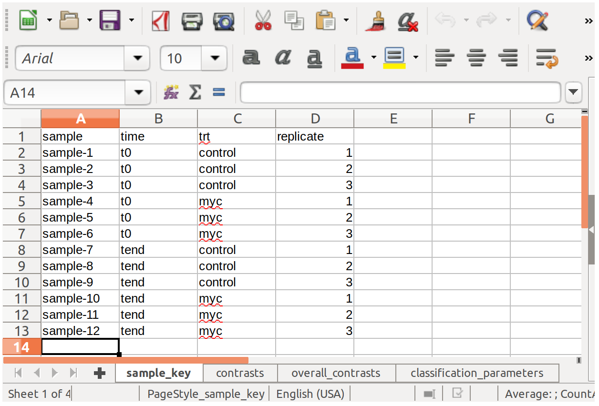

This package is part of the pipeline developed for Genialis platform for processing shRNA data.

The main function is `doDE`, which performs importing of all the necessary parameters (from the parameters file) and performs the differential expression, classification and outputs results in text files. In addition, there are `makeLibrary` function which takes in a list of shRNA, gene and sequences and converts it to a valid `.fasta` file. Function `summaryTable` will scrape alignment and trimming reports and produce a summary table.

There are two inputs to `doDE`. One is a path to expression files. Each expression file has rows of shRNA and one column. Column should be named as sample (without file extensions, e.g. `SCR-time0` for `SCR-time0.txt`). Second input is a parameter file. Currently this is an `.xlsx` file, but this limitation could be lifted in the future.

The file holds tabs `sample_key`, `contrasts`, `overall_contrasts` and `classification_parameters`. See file in `inst/extdata` for further details.

A word on `sample_key` tab. The study design should have fixed columns _sample_ and _replicate_. All other columns which describe your experiment will be used to construct a formula used in `DESeq` as `0 + ... + replicate` where `...` represents a group of samples from the same treatment (e.g. _sample-1_ would belong to a group `t0_control`). Please see [tests](/tests/testthat/test-doDE.R) on how to run the pipeline as well as which outputs are expected. Each function should be documented. If you find any issues, please do not hesitate to post in Issue tracker.

